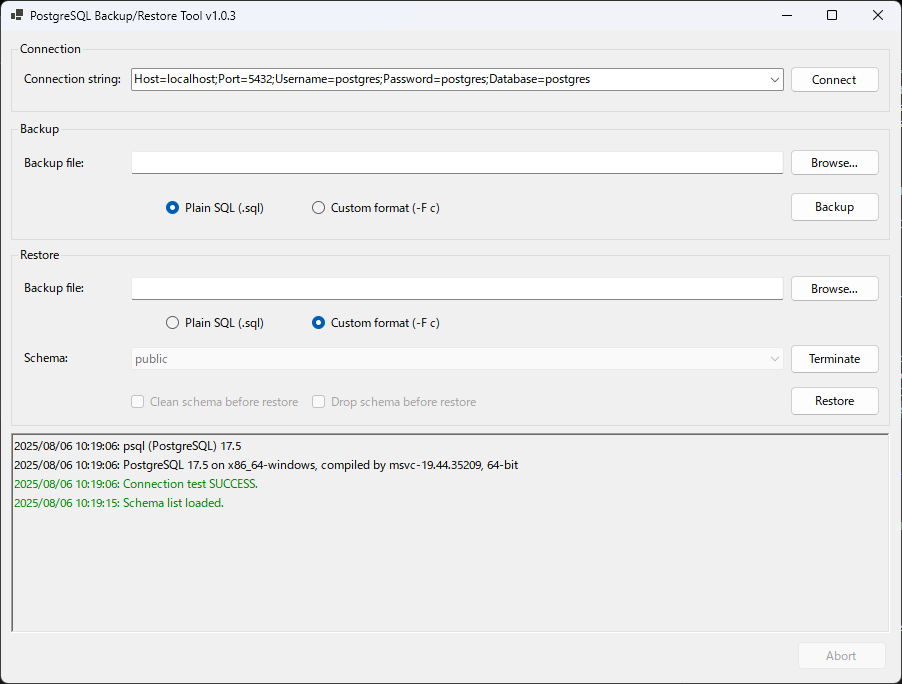

# PgBackupRestoreTool

**PgBackupRestoreTool** is a lightweight GUI tool built with **.NET 8** for backing up and restoring PostgreSQL databases using the official client tools (`pg_dump`, `pg_restore`, `psql`, etc). It supports both local and remote PostgreSQL connections.

## 🚀 Features

- 📦 **Backup** database with:
  - Custom format (`pg_dump -F c`)
  - Plain SQL format (`pg_dump` default)
- ♻️ **Restore** database from:
  - Custom format (`pg_restore`)
  - Plain SQL format (`psql`)
- 🖱️ **Drag & drop** support: drop a file onto the Restore-file textbox to auto-populate the path
- 🗜️ **Improved status bar layout** with a `TableLayoutPanel` to keep consistent spacing between the progress bar and Abort button
- 🖥️ Local or remote host selection via connection‐string dropdown
- 📂 File‐browsing dialogs for both backup and restore paths
- ✅ Connection‐test button to verify credentials
- 🔒 UI controls auto‐disable during long‐running operations to prevent conflicts
- 🌐 Automatically sets `PGCLIENTENCODING=UTF8` for proper encoding
- 💾 **Configuration** persisted to `dbconfig.json` (instead of an INI file)

## 🧰 Requirements

- Windows with [.NET 8 Runtime](https://dotnet.microsoft.com/en-us/download/dotnet/8.0) installed  
- PostgreSQL client tools must be installed and available in your system `PATH`:
  - `pg_dump`
  - `pg_restore`
  - `psql`
  - (optional) `dropdb`, `createdb` for schema operations

## 🧑‍💻 How to Use

### 1. Clone the Repository

```bash
git clone https://github.com/Chrono-Divide/PgBackupRestoreTool.git
cd PgBackupRestoreTool
```

### 2. Build and Run

Open the solution in Visual Studio 2022+ or use the .NET CLI:

```bash
dotnet build
dotnet run --project PgBackupRestoreTool
```

> To publish as a standalone executable:
> 
> ```bash
> dotnet publish -c Release -r win-x64 --self-contained true
> ```

### 3. Initial Configuration

On first run, a `dbconfig.json` file will be created in the application folder. You can edit it manually or let the UI save new connection strings.

#### `dbconfig.json` example

```json
{
  "ConnectionStrings": [
    "Host=localhost;Port=5432;Username=admin;Password=admin;Database=bks"
  ],
  "LastUsedConnection": "Host=localhost;Port=5432;Username=admin;Password=admin;Database=bks"
}
```

- **ConnectionStrings**: list of known connection‐string entries  
- **LastUsedConnection**: which entry was last tested/saved

## 📸 Screenshot

 

## 📝 License

This project is licensed under the [MIT License](LICENSE).
